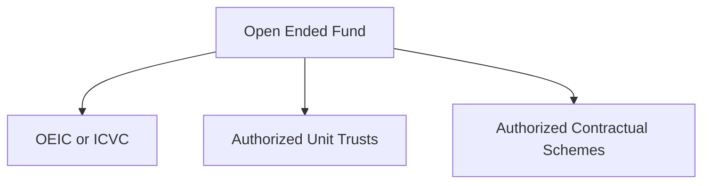

# UK Fund FAQ

## **Definition**
A fund is a way for a group of investors to pool their money to invest in things, benefiting from economies of scale, more flexibility

## **Kinds of Fund**
- Open Ended - where the number of shares or units in it isn’t fixed.
- Closed Ended - where the number of shares or units is fixed. This is usually at the point the fund is established, where everyone pools their money and gets shares in return.

### Closed Ended Fund
**Setup:** When the fund is set up, they issue shares. Sometimes you can sell those shares on, sometimes you can’t – some of those companies are exchange traded: so you can buy and sell those shares amongst other investors, but you don’t generally buy or sell them from/to the fund itself.

Sometimes it may want to raise more money by selling shares to the investor which is called **offering**

### Open Ended Fund

- OEIC or ICVC - Open Ended Investment Company (OEIC) or Investment Company with Variable Capital (ICVC). Mostly deal with this one.
- Authorised Unit Trusts - an older way of setting things up where there isn’t a company involved, but a trust
- Authorised Contractual Schemes - a new way of setting things up where it’s a series of contracts

#### ICVC 
**Setup:** Is an actual company - has board of directors and shareholders. Has to publish accounts and get audited. Need special rules:

- Investment manager required
- Have to have depository - independent company that legally holds all the company property.
- It can be an umbrella company - one ICVC have multiple sub-funds.

It can be ETF but not close ended. When there is huge demand for ETF, ICVC issues a lot of shares to big brokers and investment banks who then add those shares to the market,

Difference between normal ICVS and ETF ICVC?
Normal ICVC lets you buy or sell when they say you can which ETF can be freely traded. Normal ICVC will buy or sell based on NAV while in ETF, prices is decided by the exchange. Thus ETF can trade at premium or discount to the NAV.

**Types of Shares :**
Whenever a company in the UK takes company money and gives it to shareholders, it’s called a “distribution”.

- Accumulating (ETF: Capitalising) - the company takes the distribution, and instead of giving it to you in cash, buys more assets with the money. (Growth in India). 
	- Removes liability to decide whether to reinvest the income from the fund and avoids any cost of reinvesting.
- Income (ETF: Distributing)- the company takes the distribution and gives it to you physically to do what you want with it. (Dividend in India)
	- Gives an option to decide what to do with the income.

**Different types of Class Shares (A,B,C,D,X,Y,Z etc)**
That is a way for funds to sell the same fund to different types of shareholders – each share class will probably have different charges and different minimum investments
 
## Buy a Fund
- ETF - Directly from Stock market
- Normal ICVC 
	- Direct from the Fund - Might need a quite large minimum investment (most funds done like hassle of dealing with lots of individual clients). If want to buy online, one cannot hold it in wrapper like ISA of SIPP
	- Broker/Platform - Retail buys from Brokers mostly. Broker is like a reseller. 

## Fund Cost
The fund ICVC is going to have costs such as:

-   buying and selling the underlying assets
-   audit
-   paying the fund manager
-   dealing with shareholders

That’s reflected in your ongoing charge/annual management charge/total expense ratio.

## Types of Fund Cost

|  | OCF | AMC | TER |
|--|--|--|--|
|Full Form |**Ongoing Charges Figure**  | **Annual Management Charge**|**Total Expense Ratio** |
|Definition|Include TER but also running costs|Fee charged by Fund for the privilege of investing you money|How much of your investment disappear each year|
|Includes|TER + audit costs, regulatory communication, shareholder communication||Fund Management, Entry/Exit cost, Dilution levies etc.|

There are other costs borne by the fund and show up as reduced performance:
- Trading costs (Commissions to brokers)
- Hedging costs
- Borrowing costs
- Stamp Duty

**Some fund charges are dual priced:** to try and insulate other shareholders from the cost of dealing with new buyers, or when one individual wants to sell. They want to avoid a situation where a large shareholder sells up and the costs are borne by lots of little shareholders: that would be unfair and not a good selling point.

Thumb Rule: Ignore AMC, look at OCF and what it is made up of.

### Fund goes bust

If went insolvent, say, the ICVC has been fined millions and can’t pay – then if the fund is authorised in the UK, **you will be covered by the FSCS up to £50,000**, if the fund has somehow lost the underlying assets.

### Broker goes bust

The same thing as above – your shares are held by a custodian or ring-fenced and will just be transferred to a new broker. If they are missing for some reason, then **you are covered up to £50,000.**

Markdown
: Definition
<!--stackedit_data:
eyJoaXN0b3J5IjpbMTc1MDcxMjI1OSwxNDg1MDQ2NzUzLDE3OD
UxMjIzMSwtMjAxNDE2OTM1OCwtMjExNzY0ODAyMSwtMTc2MDQz
NzY0OF19
-->