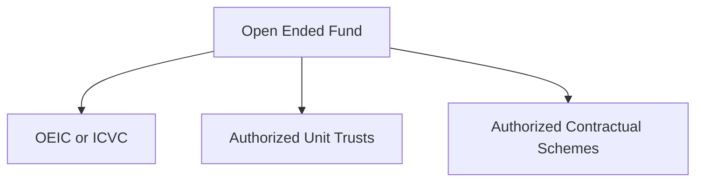

# UK Fund FAQ

## **Definition**
A fund is a way for a group of investors to pool their money to invest in things, benefiting from economies of scale, more flexibility

## **Kinds of Fund**
- Open Ended - where the number of shares or units in it isn’t fixed.
- Closed Ended - where the number of shares or units is fixed. This is usually at the point the fund is established, where everyone pools their money and gets shares in return.

### Closed Ended Fund
**Setup:** When the fund is set up, they issue shares. Sometimes you can sell those shares on, sometimes you can’t – some of those companies are exchange traded: so you can buy and sell those shares amongst other investors, but you don’t generally buy or sell them from/to the fund itself.

### Open Ended Fund

- OEIC or ICVC - Open Ended Investment Company (OEIC) or Investment Company with Variable Capital (ICVC). Mostly deal with this one.
- Authorised Unit Trusts - an older way of setting things up where there isn’t a company involved, but a trust
- Authorised Contractual Schemes - a new way of setting things up where it’s a series of contracts

#### ICVC 
**Setup:** Is an actual company - has board of directors and shareholders. Has to publish accounts and get audited. Need special rules:

- Investment manager required
- Have to have depository - independent company that legally holds all the company property.
- It can be an umbrella company - one ICVC have multiple sub-funds.

**Setup:** 

<!--stackedit_data:
eyJoaXN0b3J5IjpbLTc3MjYyODc2MSwtMTc2MDQzNzY0OF19
-->